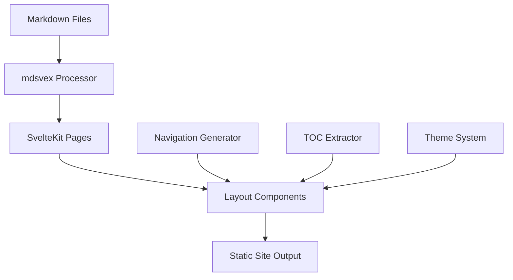

# Design Document

## Overview

The SvelteKit docs site will be a static site generator that processes Markdown files using mdsvex and presents them in a clean, three-column layout. The architecture follows SvelteKit's file-based routing system with automatic navigation generation and table of contents extraction.

## Architecture

### High-Level Architecture



### Directory Structure

```
src/
├── lib/
│   ├── components/
│   │   ├── Layout.svelte
│   │   ├── Sidebar.svelte
│   │   ├── TableOfContents.svelte
│   │   └── ThemeToggle.svelte
│   ├── utils/
│   │   ├── navigation.js
│   │   ├── toc.js
│   │   └── theme.js
│   └── stores/
│       └── theme.js
├── routes/
│   ├── +layout.svelte
│   └── [...slug]/
│       └── +page.svelte
├── docs/
│   ├── index.md
│   ├── getting-started/
│   │   └── installation.md
│   └── guides/
│       └── configuration.md
└── app.html
```

## Components and Interfaces

### Core Components

#### 1. Layout Component (`src/lib/components/Layout.svelte`)
- **Purpose**: Main layout wrapper providing three-column structure
- **Props**: 
  - `title: string` - Page title
  - `navigation: NavigationItem[]` - Navigation tree
  - `tableOfContents: TOCItem[]` - Page TOC
- **Responsibilities**:
  - Render header with site name and theme toggle
  - Manage responsive layout
  - Coordinate sidebar and content areas

#### 2. Sidebar Component (`src/lib/components/Sidebar.svelte`)
- **Purpose**: Left navigation sidebar
- **Props**:
  - `navigation: NavigationItem[]` - Hierarchical navigation structure
  - `currentPath: string` - Active page path
- **Responsibilities**:
  - Render nested navigation tree
  - Highlight active page
  - Handle collapsible sections

#### 3. TableOfContents Component (`src/lib/components/TableOfContents.svelte`)
- **Purpose**: Right sidebar with page outline
- **Props**:
  - `headings: TOCItem[]` - Extracted headings
- **Responsibilities**:
  - Render heading hierarchy
  - Handle smooth scrolling to sections
  - Track scroll position for active highlighting

#### 4. ThemeToggle Component (`src/lib/components/ThemeToggle.svelte`)
- **Purpose**: Light/dark mode switcher
- **Responsibilities**:
  - Toggle between themes
  - Persist user preference
  - Respect system preference

### Data Models

#### NavigationItem Interface
```typescript
interface NavigationItem {
  title: string;
  path: string;
  children?: NavigationItem[];
  order?: number;
}
```

#### TOCItem Interface
```typescript
interface TOCItem {
  id: string;
  title: string;
  level: number; // 1-6 for h1-h6
  children?: TOCItem[];
}
```

#### Theme Interface
```typescript
type Theme = 'light' | 'dark' | 'system';

interface ThemeConfig {
  current: Theme;
  system: 'light' | 'dark';
}
```

## Data Models

### Navigation Generation
- **Source**: File system structure in `src/docs/`
- **Processing**: Recursive directory traversal
- **Metadata**: Extract frontmatter for titles and ordering
- **Output**: Hierarchical navigation tree

### Table of Contents Extraction
- **Source**: Markdown heading elements (h1-h6)
- **Processing**: Parse rendered HTML or markdown AST
- **Structure**: Nested based on heading levels
- **Links**: Generate anchor IDs for smooth scrolling

### Theme Management
- **Storage**: localStorage for persistence
- **Detection**: CSS media query for system preference
- **Application**: CSS custom properties for theme variables

## Error Handling

### File System Errors
- **Missing docs directory**: Create default structure with sample content
- **Invalid markdown**: Display error message with file path
- **Broken internal links**: Log warnings and highlight in development

### Navigation Errors
- **Circular references**: Detect and break cycles
- **Missing frontmatter**: Use filename as fallback title
- **Invalid ordering**: Sort alphabetically as fallback

### Theme Errors
- **localStorage unavailable**: Fall back to system preference
- **Invalid stored theme**: Reset to system default
- **CSS loading failures**: Provide basic unstyled fallback

## Testing Strategy

### Unit Tests
- Navigation generation logic
- TOC extraction utilities
- Theme management functions
- Component prop validation

### Integration Tests
- Full page rendering with layout
- Navigation state management
- Theme persistence across sessions
- Responsive layout behavior

### End-to-End Tests
- Complete user journeys
- Cross-browser theme switching
- Navigation and scrolling behavior
- Accessibility compliance (WCAG 2.1 AA)

### Performance Tests
- Large documentation sets (100+ pages)
- Navigation tree rendering performance
- Theme switching responsiveness
- Static site generation speed

## Implementation Considerations

### SvelteKit Configuration
- **Adapter**: `@sveltejs/adapter-static` for static site generation
- **Prerendering**: Enable for all routes
- **mdsvex**: Configure with syntax highlighting and custom components

### CSS Architecture
- **Approach**: CSS custom properties for theming
- **Framework**: Minimal custom CSS, no external frameworks
- **Responsive**: Mobile-first design with CSS Grid/Flexbox
- **Accessibility**: Focus indicators, sufficient contrast ratios

### Performance Optimizations
- **Code splitting**: Lazy load non-critical components
- **Image optimization**: Automatic optimization for markdown images
- **Caching**: Leverage SvelteKit's built-in caching strategies
- **Bundle size**: Tree-shake unused dependencies

### Accessibility Features
- **Keyboard navigation**: Full keyboard support for all interactions
- **Screen readers**: Proper ARIA labels and semantic HTML
- **Color contrast**: WCAG AA compliance in both themes
- **Focus management**: Logical tab order and visible focus indicators